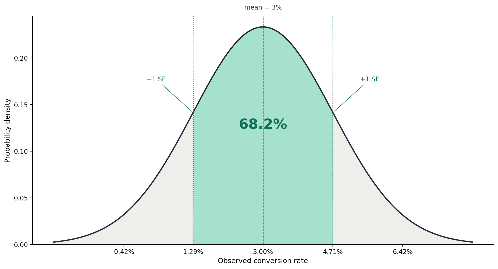
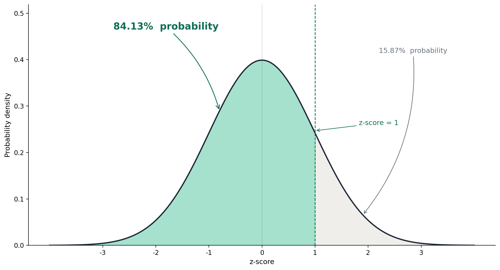

Suppose you ran an A/B test on the signup page of your app. You wanted to ship a new version, but you weren't sure
if it is actually better, so you decided to A/B-test it. You did the experiment, and you've got these numbers:

- Baseline conversion: **3%**
- New version conversion: **3.5%**

Things looks good. The conversion rate is better, so the new version must be better, right? Well, not necessarily.

Let's say there are three realities of this experiment. Three companies, exact same experiment and result, but
different number of visitors in their experiments. The first had 100 visits per version - the original and new signup
page; 200 visits in total. The second had 1,000 per version. The third had 10,000 per version.

Which reality has the highest chance that the new version is *actually* better? By intuition, most would agree it should
be the 10,000-customer one. By the end of this post, we'll quantify the exact probability that the new version is
actually better for each one of these realities. More importantly, we'll explore why averages could deceive us into
conclusions the data don't warrant, potentially leading us into a worse off situation.

### A quick intuition first

Before any math, let start with an intuition. You flipped a coin 4 times and get 3 heads; the average heads is 75%.
Would you assume the coin is biased? Absolutely not, 3 out of 4 happens all the time with a fair coin. Now you flipped
the same coin 4000 times and got 3000 heads, same 75%, how do you feel this time? the coin can't possibly be fair,
right?

That's the **law of large numbers**: as you take more samples (flipping more coins), the sample average (heads or tails)
converges to the true average (that is, 50%). The more sample, the closer the observed average (the one we measure) gets
to the real one. Hence, with 10 samples, the proportions of heads could be 65%, with 100 samples, maybe 55%, but as we
increase the samples more and more, it should approach ~50%.

Back to the example, when we flipped the coin 4 times, the average heads was 75% and that was totally plausible, but for
the 4000-flips case, it's almost impossible to get that average with a fair coin; the probability is just insanely low
to the point that we can logically assume the coin is not fair, and we would be right.

You should see now why the average alone tells very little. The average plus the sample size reveals whether the
observed average is signal or noise.

Same thing with A/B tests. We're going to walk through why a 3% (original) vs 3.5% (experiment) could mean different
things based on the number of visitors. It could mean the new version is better, but it could also mean the whole
experiment is just measuring the noise where the actual effect is unknown from the data: maybe better, neutral, or even
detrimental; without sufficient sample size, you can never be sure *enough* of the true effect.

> NOTE: Since we're dealing with a binary dataset, proportion = average. I'll use both term interchangeably. Keep in
> mind, the concepts we're applying here to proportions (conversion rate) does apply to averages in general.

### The standard error

The new "3.5%" rate we observed from the experiment is the conversion rate of *the visitors who happened to land in the
experiment*. The thing you care about; the rate you'd see if all your future visitors used this version, is unobservable
future. You're trying to guess it from a sample.

If you ran the same A/B test twice, on two different groups of visitors, you'd get slightly different numbers each time.
So the question is, how to tell the difference in conversion rate is due to the experiment and not due to an expected
noise in measurement.

The **standard error of a sample average/proportion** tells you, roughly, how much that proportion would change if you
re-ran the experiment, just by pure chance. Same signup page with the same number of visitors, just different people.

For proportions, like the conversion rate, the formula is:

$$ SE = \sqrt{\frac{p(1-p)}{n}} $$

Where `n` is the number of visitors. The `p` is the observed proportion; you can also think of it as the probability
that any random visitor would convert.

Let's compute it for the **baseline conversion rate** of reality 1 (100 visitors):

$$ SE = \sqrt{\frac{0.03 \cdot 0.97}{100}} \approx 1.71 $$

The value of `SE` is the standard deviation of the average.

What this tells you essentially is that if you just repeat the measurement for the original signup page with exactly
100 visitors, it's more likely than not to fall within `3% ± SE` (1.29 - 4.71%). The difference is driven by noise;
absolute noise, zero signal.

As shown by the graph, the range `p ± SE` covers ~68.2% of outcomes. Simply put, if you repeat the measurement 100
times, 68 of the 100 conversion rates would fall within that range; remaining 32 fall outside the SE range. If you want
to be more strict, you typically extend the range to `2 * SE`, which covers ~95% of outcomes.

Let's compute it for the three realities.

| Visitors |     SE | Where the true rate most likely sits |
|---------:|-------:|--------------------------------------|
|      100 | ~1.71% | 1.29% – 4.71%                        |
|    1,000 | ~0.54% | 2.46% – 3.54%                        |
|   10,000 | ~0.17% | 2.83% – 3.17%                        |

Notice the pattern: each time we 10x the data, the standard error drops by a factor of about 3 (specifically
$ \sqrt{10} \approx 3.16 $). Put differently, to cut the noise in half, you need to quadruple the sample size.

So for Reality 1, the swing is roughly ±1.7%, but the lift in conversion rate we observed is only 0.5%; the noise cover
the whole potential "signal." In Reality 3, the swing is roughly one-third (0.5/0.17) of the lift; that implies we're
likely getting a signal here, because the nosie alone won't likely increase the rate by 0.5%.

Things are getting more complicated, but we're almost there.

### What's the probability the new version is actually better?

Now comes the big question:

> Given the data I observed, what's the probability the new version is actually better than the baseline?

That's a Bayesian question under a flat prior, and here is the math to compute it:

$$ P(\text{new is better}) = \text{norm.cdf}\left(\frac{\text{observed lift}}{SE_{\text{diff}}}\right) $$

The $ SE_{\text{diff}} $ is basically the **standard error of the difference** in conversion rate between the baseline
and the new version. Just like averages, the observed lift has error margin. To compute it, we simply add the standard
error of the two:

$$ SE_{\text{diff}} = \sqrt{SE_{\text{baseline}}^2 + SE_{\text{new}}^2} $$

That ratio (observed lift / $SE_{\text{diff}}$) is called the **z-score**. Simply put, it's "how many standard
errors away from zero is the observed lift." A big z-score means the lift is far from zero (likely real). A small
z-score means the lift is barely above zero (probably noise).

The function is a CDF of bell curve that converts a z-score into a probability. It basically computes the area under the
curve:

Now, we've got everything we need; let's compute the probability for each of the hypothetical realities — the
probability the new version is actually better than the baseline:

| Visitors per version | z-score = lift / $SE_{\text{diff}}$ | $P(\text{new is better})$ |
|----------------------|-------------------------------------|---------------------------|
| 100                  | 0.5 / 2.51 ≈ 0.2                    | ~56%                      |
| 1,000                | 0.5 / 0.79 ≈ 0.63                   | ~74%                      |
| 10,000               | 0.5 / 0.25 ≈ 1.99                   | ~98%                      |

In Reality 1, the probability is just 56%; that's roughly a coin flip. You can basically ignore the experiment entirely
and just ship based on what you think is better. The thing is, the data doesn't provide any evidence to support your
decision. More importantly, if you made many decisions each with ~56% likelihood of success, you will be wrong ~44% of
the time.

For Reality 2, it was 74%. Better, but ask yourself: would you ship a change you're 74% sure is positive and 26% sure is
neutral or negative? For high-risk product changes (e.g., pricing page), I don't think that would be enough confidence.
In such cases, you may want to keep the experiment running for longer; if the hypothesis is right, expect the
probability to increase over time as you gather more and more samples.

Reality 3 has a decisive probability of 98%. You can act on it without second-guessing; you should be almost
certain at this point. That's what you can confidently call "data-driven decision."

> 💡 There are mathematical formulas to compute how many samples you actually need to reach a specific threshold of
> certainty (e.g., 90% confidence the effect is real). Look up "statistical power" and "sample size calculation." You
> may as well explore the concept of "confidence interval," the range of plausible truths.

### What this means in practice

The conversion rate didn't change between the three realities, but how much that 0.5% lift deserves to be believed was
different in each. I believe a lot of A/B tests out there are underpowered to support data-driven decisions. Even worse,
it could deserve us into false confidence.

If your business don't have sufficient sample size to justify data-driven decision, don't bother. Follow your intuition
or use some other strategies that genuinely shift your internal confidence. More importantly, be mindful of other
possibilities when you rely on averages, and keep a close eye when the stakes are high. Don't let the average fool you.

If averages alone give you certainty, you will likely be more wrong than right. A lot of smart people I know fall for
the *small sample trap*, making significant decisions and putting all the blame on the average when things didn't follow
the expected trajectory.

I'm convinced that **averages lie, more often than not**.
