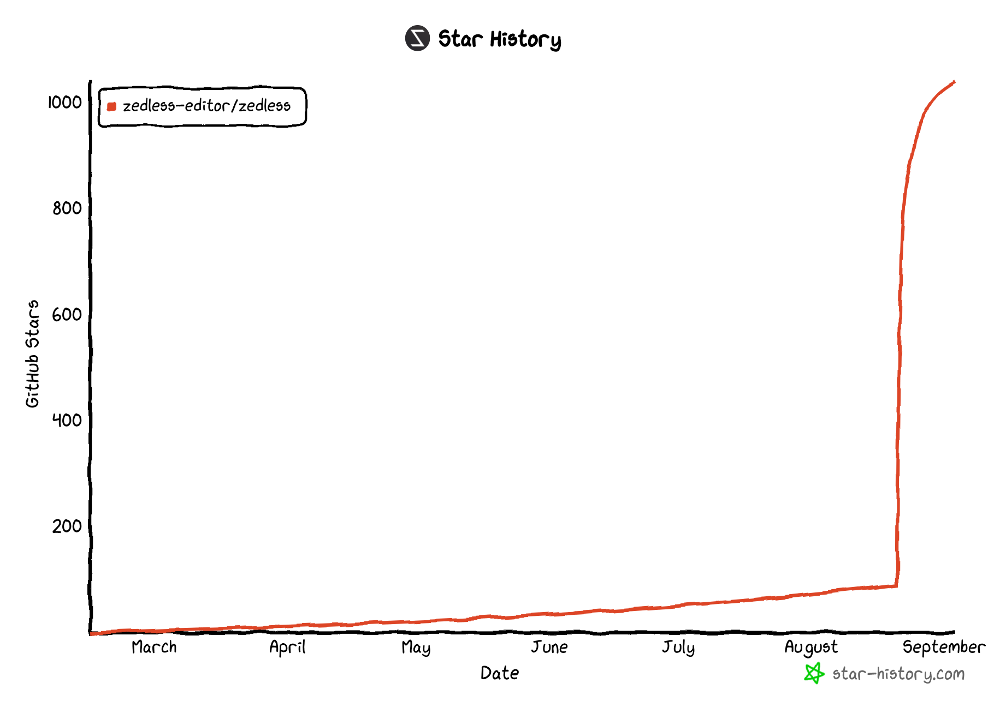
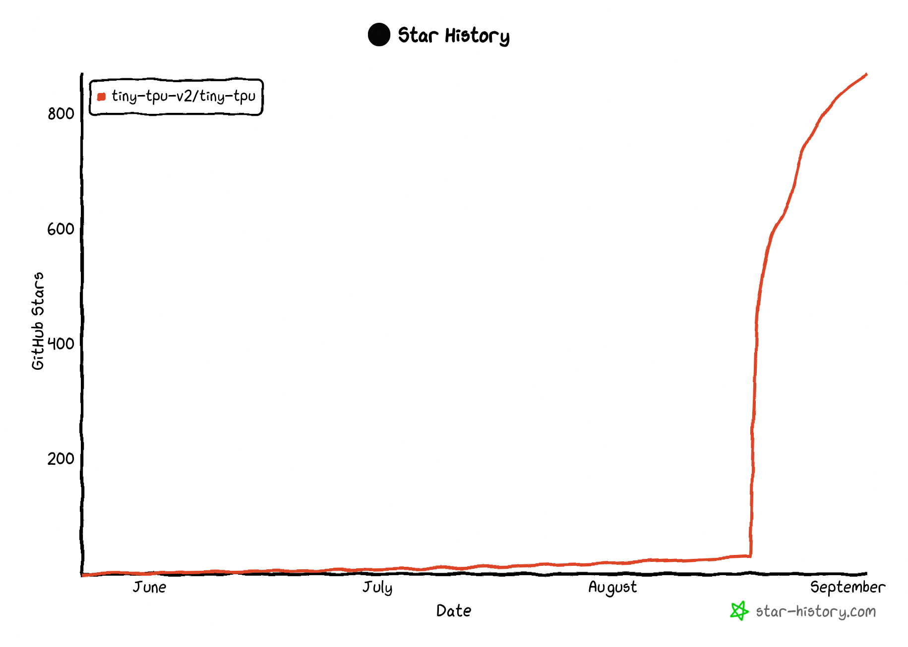
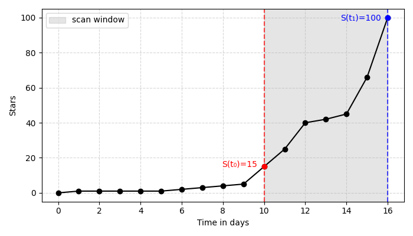

**TL;DR**; frustrated with [Github's trending page] featuring stale projects, I built a weekly newsletter featuring
*fresh* trending projects using star growth analytics. The newsletter delivered via

- **Email** (weekly newsletter)
- **Github notifications** (weekly via releases)
- **RSS feed** (individual repo feeds; updated daily)

I've already discovered amazing projects I wouldn't have known otherwise. Take a look at the [previous issues].

I built this for myself, but then realized others might find it useful too. This post documents my exploration building
the newsletter.

Github: https://github.com/mhadidg/gh-trends

### Github's trending is not exciting

You open Github's trending page, hoping to discover something new and exciting. Instead, you get <small>[1]</small>:

- django/django (2005) - as old as YouTube
- twbs/bootstrap (2011) - predates the iPhone 5
- hashicorp/terraform (2014) - Obama was president

I've seen these (and many similars) on the trending page every x day for years.

Don't get me wrong; these are fantastic projects, but they are not news anymore. They are not fresh. They are just
popular. I happen to know all about them, and so do most software engineers.

Give me something fresh, something I don't know. (Github: 404)

Thanks to LLMs, we're living through the most explosive era of software development in history. Amazing tools are
emerging daily. Yet, I'm not aware of any tool that helps me discover awesome *fresh* open-source projects. Stuff that
just got big attention the past few days or weeks. Stuff I haven't seen before.

Out of despair, I decided to build my own.

### A naive start

My initial (silly, in retrospect) thought: Query the Github API, sort by stars, and filter by creation date for the
past week. Could work, right?

I shortly realized it wouldn't. Most innovative projects follow this pattern:

- Created months/years ago as private repos
- Developed in stealth mode
- Suddenly open-sourced and gets ton of excitement

Repo metadata from Github's API has no field for "made public" date. I can't catch these projects if I simply filter by
creation date.

I need a different approach.

### Scanning Github events

Github [emits events] for everything. For my interest, two events are relevant:

- **CreateEvent**: when a repo is created (public ones)
- **PublicEvent**: when a private repo is made public

I could use these events to figure out when a repo was "first seen" publicly.

Github API for events (used to be [daily JSON dumps] pre-2015) doesn't support filtering by event type or date range.
Practically useless for my purpose.

I discovered something better: public datasets of [Github events on BigQuery] and [ClickHouse]. Full event history,
queryable with SQL, both are superfast for
analytics. Problem solved.

BigQuery's free tier felt inadequate for my use case; a terabyte of processed data per month. I depleted it in a few
queries. Github events are no joke.

ClickHouse's free tier is far more generous:

- 10B rows per query
- 1000 rows returned
- 60 queries per hour

Plus, API integration is dead simple.

<details>
<summary>Click to view: cURL example</summary>

```
curl -X POST 'https://play.clickhouse.com/?user=play' \
  --data-binary \
     'SELECT event_type, actor_login 
      FROM github_events 
      LIMIT 1 
      FORMAT JSON'

{
  "rows": 1,
  "meta": [...]
  "statistics": {...}
  "data": [{ 
    "event_type": "CommitCommentEvent", 
    "actor_login": "IgorMinar" 
  }],
}
```

</details>

> *Side note*: You can do [crazy things] with Github events on Clickhouse for free. Try out [the old] or [newer version]
> of their SQL playground.

My strategy became: scan for fresh trending repos (created or made public in the last *x* days, sort by stars, and limit
to *y* items). Apply some ranking on the client side, and pick top n to feature. Easy-peasy.

<details>
<summary>Clickhouse query: find trending repos</summary>

```sql
WITH now() - INTERVAL 7 DAY AS cutoff
SELECT repo_name,
  countIf(event_type = 'WatchEvent') AS stars,
  greatest(
    maxIf(created_at, event_type = 'PublicEvent'),
    maxIf(created_at, event_type = 'CreateEvent' AND ref_type = 'repository')
  ) AS first_seen_at
FROM github_events
WHERE created_at >= cutoff
GROUP BY repo_name
HAVING first_seen_at >= cutoff
ORDER BY stars DESC, first_seen_at DESC 
LIMIT 100
```

</details>

That kinda worked, until I realized I'm still missing a pretty common pattern.

### Sometimes fresh ≠ new

There seem to be a lot of projects that don't gain traction immediately after going public. They just sit with modest
star counts for months (sometimes years), then suddenly explode as they

- hit a milestone,
- get featured somewhere (looking at you, Hacker News),
- or simply reach the right audience.

A few examples from the *recent history*:

- [zedless-editor/zedless]: First seen on Feb 14, 2025. Made 90 stars until Aug 20. Blew up to over 1k stars in a
  single week after.
- [tiny-tpu-v2/tiny-tpu]: First seen on May 23, 2025. A handful of stars until Aug 19. Blew up to ~1k stars in a week.
- [epicenter-so/epicenter]: First seen on March 20, 2023. Made ~1k stars gradually until Aug 14, 2025. Blew up to ~3k
  stars in two weeks.

<div style="display:flex; justify-content:center; gap:20px; margin-top:30px;">
  
  
</div>

### Clickhouse samples events

I found out that star count data from Clickhouse was incomplete. The total (for a given repo) are about half of what I
see on Github.

Looks like Clickhouse sample events.

Wait... doesn't that means critical events (*CreateEvent* and *PublicEvent*) for some repos could also be missing 🤔

I don't mind missing stars events, I could still get the actual star count from Github API. But I'm filtering repos
based on specific events, and if these events are also sampled, I'd be missing a lot.

I was right. A Clickhouse query confirms.

<details>
<summary>Click to view the query</summary>

*(this query returns no event; give it a try for some other repo; you've got 50/50 chance of getting a non-empty
result)*

```
SELECT *
FROM github_events
WHERE repo_name = 'openai/agents.md' AND
  (event_type = 'PublicEvent' OR (event_type = 'CreateEvent' AND ref_type = 'repository'))
```

</details>

I'm done with this approach. I need something better.

### Growth-based approach

Still scanning Github events, but let's shift gears a bit...

Instead of focusing on when the repo was "first seen," I thought of calculating the *relative star growth* over a time
window. After all, *public inception* (when the spike begins) is far more important than creation date, right? Makes a
lot
of sense.

The birth of the new formula.

$$ \frac{S(t_1) - S(t_0)}{S(t_0)} \geq k $$

- $S(t_0)$: stars count at the beginning of the window
- $S(t_1)$: stars count at the end of the window
- $k$: growth factor threshold (e.g., 1 for 100% growth, 2 for 200%, etc.)

<p align="center" style="margin-top:30px;">
  
</p>

In practice, this proved to be really effective.

<details>
<summary>Curious? expand to see the Clickhouse query</summary>

```sql
WITH
  {evalDate}::timestamp AS END_DATE,
  END_DATE - INTERVAL {window} DAY AS START_DATE,
  {limit} AS LIMIT_N,
  {growthRate} AS MIN_GROWTH_RATE
SELECT
  repo_name as repoName,
  countIf(event_type = 'WatchEvent' AND created_at < START_DATE) AS starsBefore,
  countIf(event_type = 'WatchEvent' AND created_at >= START_DATE) AS starsWithin,
  minIf(created_at, event_type = 'WatchEvent') AS firstSeenAt
FROM github_events
WHERE event_type = 'WatchEvent' AND created_at <= END_DATE
GROUP BY repoName
HAVING starsWithin / starsBefore > MIN_GROWTH_RATE
ORDER BY starsWithin DESC
LIMIT LIMIT_N
```

</details>

I tried different growth factors (x1-5) and settled with x3.

Higher factors missed some with very recent *public inception*. Lower factors penalize freshness: somewhat-known older
repos start to show up, especially those from the week before.

As you may have guessed it, popular old repo have no chance. For example, *Django* currently has ~80k stars. To match x3
growth, it should get 240k stars in a week. Would definitely earn a seat if that ever happen.

### The malware problem

At this point, I was pretty happy with the results. But a peculiar issue emerged.

I got surprised by tens of malware repos matching my query. Almost all of them share some common traits:

- Made by a fresh Github user (often created in the past few days).
- The average creation date of Stargazers (users, not staring event) is very close to the repo creation date; the
  reality of fake stars.
- They are mostly about crypto, NFTs, KMS, and the like.

I put some safeguards in place to filter out these repos. But I don't think it's foolproof (yet). I'll iterate to make
sure not a single malware gets through.

### A lost effort?

I discovered lately a *daily* newsletter called [Changelog Nightly] with quite similar intent. I didn't know about it
when I started my project. I honestly believe that I wouldn't have built this if I knew about it earlier.

Turns out, I might have built something slightly different, and overall better.

While the concept is similar, the execution seems different. I compared the two side by side for a [single week] (Aug
25-31); *Changelog Nightly* missed a couple of gems mine featured. Just to name a few:

- [renzorlive/vimmaster]
- [hotheadhacker/seedbox-lite]
- [run-llama/semtools]
- [ghuntley/how-to-build-a-coding-agent]

Similarly, theirs had featured a dozen of repos that mine didn't (excluding "Repeat Performers" section). Their logic
is clearly a bit different, but more importantly, these repos *mostly* fall in one of two categorizes:

1. **Low in ranking**: I only include the top 20 in my newsletter, low-ranked repos get filtered by definition. I used
   star velocity for scoring (i.e., stars per hour). I could easily raise the top n to 30 or even more, but I'd rather
   not bloat the newsletter.

2. **A renamed repo**: sometimes when a repo got renamed, it suddenly gets a wave of stars. The Clickhouse query catch
   those as "fresh" repos, but they are not. For example, *firecrawl/firecrawl* used to be *mendableai/firecrawl*.
   Also, *getAsterisk/opcode* used to be *getAsterisk/claudia*. I don’t feature repos just because a name change makes
   them look fresh.

> 💡 If you're not happy with the top n set to 20, set your own <small>[2]</small>.

That said, I think both newsletters are great. Subscribe to both and see for yourself.

### Personalize it

I automated the whole thing with Github Actions. Serverless, zero operational cost, and fully automated. Though once I
exceed the free tier for Resend (the 1k subscribers limit), it will no longer be cost-free.

It's an open-source project. I highly encourage you to fork it and make your own personalized version. Some ideas:

<div class="github-trends customize-it">

- Filter in/out based on topics, languages, or anything else.
- Use AI classifier to personalize the selected repos based on your niche interest.
- Adjust the ranking formula. I'm sure some of you have better ideas.
- Change the frequency. Daily, bi-weekly, monthly, or whatever works best for you.
- Help your teams stay updated right inside *Slack*: make a new channel, add the [RSS app], and set the [feed URL].
  Done.
- Add some AI-generated summary or analysis for each repo in the newsletter.
- Make a fancy dashboard out of the data. Let users filter, sort, and explore.

</div>

---

<small>[1]</small> I didn't come up with this list. Django
was [featured](https://web.archive.org/web/20250825003850/https://github.com/trending) 9 days ago. Bootstrap got
[featured](https://web.archive.org/web/20250828021943/https://github.com/trending) a week ago, three days in a row. The
same goes for the rest.

<small>[2]</small> Fork the repo. Change [this env var]. Done! That should be enough for Github releases and RSS, but
you'll need secrets for email newsletter. I support both *Resend* and *Buttondown*; both have free tier more than enough
for personal or team-wide use.

[Github's trending page]: https://github.com/trending

[previous issues]: https://github.com/mhadidg/gh-trends/releases

[emits events]: https://docs.github.com/en/rest/using-the-rest-api/github-event-types

[daily JSON dumps]: https://www.gharchive.org

[Github events on BigQuery]: https://cloud.google.com/blog/topics/public-datasets/github-on-bigquery-analyze-all-the-open-source-code

[ClickHouse]: https://clickhouse.com/demos/explore-github-with-clickhouse-powered-real-time-analytics

[the old]: https://play.clickhouse.com

[newer version]: https://sql.clickhouse.com

[crazy things]: https://ghe.clickhouse.tech

[epicenter-so/epicenter]: https://www.star-history.com/#epicenter-so/epicenter

[zedless-editor/zedless]: https://www.star-history.com/#zedless-editor/zedless

[tiny-tpu-v2/tiny-tpu]: https://www.star-history.com/#tiny-tpu-v2/tiny-tpu

[Changelog Nightly]: https://changelog.com/nightly

[single week]: https://github.com/mhadidg/gh-trends/releases/tag/week-07

[renzorlive/vimmaster]: https://github.com/renzorlive/vimmaster

[hotheadhacker/seedbox-lite]: https://github.com/hotheadhacker/seedbox-lite

[run-llama/semtools]: https://github.com/run-llama/semtools

[ghuntley/how-to-build-a-coding-agent]: https://github.com/ghuntley/how-to-build-a-coding-agent

[RSS app]: https://slack.com/help/articles/218688467-Add-RSS-feeds-to-Slack

[Feed URL]: https://raw.githubusercontent.com/mhadidg/gh-trends/refs/heads/main/feed/rss.xml

[this env var]: https://github.com/mhadidg/gh-trends/blob/d7082b200b82bd7dc49daa173d1137e49c144ff4/.env.example#L14
