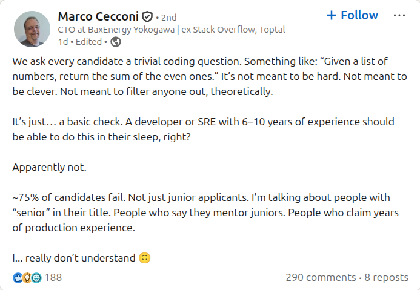
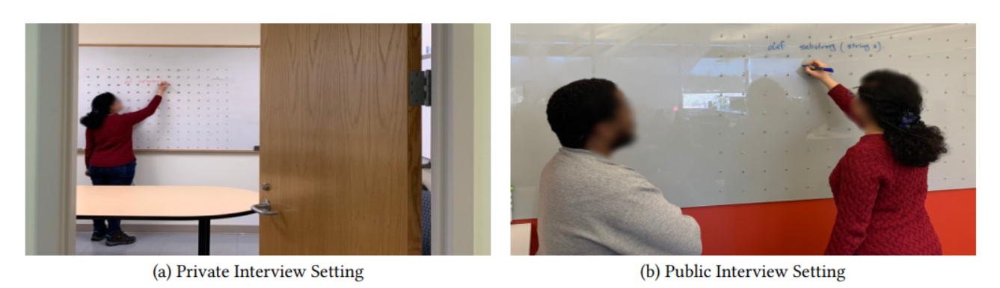

Some people enjoy live coding interviews. I'm not one of them.

Two days ago, I stumbled upon a [post on LinkedIn]:

Sounds absurd at first; why would a senior engineer, who has been writing code for years, struggle with something as
simple as a basic algorithm? Did they suddenly forget how to code? Maybe. But I have a different perspective.

### A quick anecdote

Four years ago, I applied for [Toptal]. I passed the initial stage(s). I passed a 90-minute Codility assessment - three
problems as I recall it; I solved all three, two was enough to pass. The last one was fairly hard.

Then, I failed to finish a simple live coding test (one problem) for a full 30 minutes - more or less, I don't remember
exactly. I revisited the test a few hours later, and I solved the problem in no time.

That was super confusing. The problem wasn't that hard really. I was able to solve it, but failed to do so in the live
coding session.

This triggered my curiosity, and I did some research back then. Turns out it's a well-known phenomenon in the scientific
literature. It's all about stress.

### Your brain under stress

When you're placed in a high-stakes, time-pressured situation, like live coding, your brain reacts exactly like it would
to any other threat. The amygdala [gets activated]. Cortisol levels [spike]. Your prefrontal cortex, the part of the
brain [in charge of] complex reasoning and working memory, [gets impaired]. Either mildly, moderately, or severely,
depending on the individual and their baseline stress resilience.

Working memory is the [most reliable proxy] (I know of) for fluid intelligence, your ability to reason, solve novel
problems, and think abstractly. It's what you mostly need to pass live coding tests, I believe. When your prefrontal
cortex is impaired due to stress, your working memory capacity shrinks.

For some people, especially those with even mild *performance anxiety*, it becomes nearly impossible to think clearly.
Your attention narrows. You can't hold multiple steps in your head. You forget what you just typed a few seconds ago. It
feels like your IQ dropped by 30 points. In fact, it feels like you're a completely different version of yourself; a
much dumber one.

### The definitive paper

As I was writing this post, I found a rigorous scientific study that just end the debate once and for all.

[The paper] titled “Does Stress Impact Technical Interview Performance?”, and it’s co-authored by researchers at
*Microsoft*. They basically asked participants to solve a coding problem in two settings:

- Private setting: Alone in a room; no one watching.
- Public setting: In front of a proctor, while thinking aloud.

Same task. Same time limit. Just different levels of stress.

Here's what they found: **The participants being watched scored half compared to those who were alone.**

The cognitive performance in the public setting had both a lower average and much wider spread (high variance);
indicating that some candidates are *disproportionately* impaired under stress, while others perform as usual or even
slightly better. That's why live coding is so unfair.

All of these findings are no surprise to me. But here’s a surprising finding: **not a single woman in the public setting
passed**, while every woman in the private setting did. So if your company wants to “support women in tech” but still
do live coding interviews… congrats, you’re running a scientifically validated exclusion filter.

### Performance under stress

I like to think of live coding as a proxy for *performance under stress*.

Some (rare) companies genuinely care about this. Some even mention it in their job descriptions. They want candidates
who *perform well under constant pressure* (stay away from those companies). If that's the case, then sure, live coding
might help.

But that's not how most companies frame it.

Most hirings don't mention stress resilience. They don't describe the job as "high-pressure." They're not looking for
someone to "perform well under pressure." They just want a good engineer.

The engineer who [froze] during a 30-minute LeetCode exercise might be the same person who quietly ships flawless code,
writes excellent docs, and debugs complex systems. You're not rejecting a bad engineer, you're rejecting someone who
doesn't perform well while being watched.

That's not a skill most jobs require.

Companies frame live coding as a test of your coding skills; it's misleading. Even worse, it compounds performance
anxiety. It makes candidates believe this test is a reliable measure of their coding skills. That's never true for most
engineers.

Live coding fails to measure what we think it measures. It's more accurately measuring cortisol under stress than coding
skills.

### Mitigating the stress

We can't change the fact that live coding is a common practice in tech interviews. But we can try to mitigate the stress
it causes.

The best way to desensitize your brain to stress is repeated exposure. Do mock live coding sessions that mimic the real
thing: use platforms like [Pramp], [Interviewing.io], or [LeetCode's mock assessment].

You could also set a timer, record yourself (to simulate being "watched"), and think aloud. Gradually increase
pressure (e.g., invite a friend to watch).

I've also been thinking of experimenting with some supplements that I believe might help with performance under stress.

- **L-tyrosine**: Stress depletes catecholamines, which *may* underlie the cognitive deficits we see during stressful
  situations. Supplementing with L-tyrosine [may help] replenish these neurotransmitters under stress.

- **L-theanine**: An amino acid found in tea that promotes relaxation. It has been shown to [reduce stress] and improve
  focus.

I haven't tried any of these yet (during an interview), and I'm not encouraging anyone to do so. But I think it *might*
be worth experimenting with, especially if you struggle with performance anxiety. You should definitely test it in
practice sessions first. Everyone is different, and what works for one person may not work for another.

Being bad at live coding doesn't mean you're a bad engineer. It means you're human.

### Edit #1

This post had so many great [comments and discussions] on HN. Highlighting the top comment as I think it deserves more
attention.

> I won't attempt to generalize from my case, but let me offer a personal anecdote.
>
> I'm now a successful, self-employed indie developer. One of the main reasons I stuck with indie development through
> the hard times—the maxim that it takes 5 years to become an overnight success was true for me—was that I became
> practically unhireable. There are multiple strikes against me: I'm middle age in an industry rife with age
> discrimination, I don't have a computer science degree, and I experience brain freeze during live coding interviews.
>
> I would note that not all stress is the same. Firefighters rush into burning buildings for a living, and what could be
> more stressful, yet many of them would panic at the idea of giving a speech to a non-burning roomful of strangers. I
> have no problem with stress on the job, and I've successfully navigated many work emergencies during my career, but
> something about strangers standing over my shoulder judging me, determining my financial future by providing or
> withholding a job, like the sword of Damocles, turns my stomach inside out. And like the article author, I can revisit
> the coding problems and solve them afterward, as soon as the interview is over. Interviewers must think I'm a fraud
> who can't code, yet all evidence from my career, now almost 2 decades long, suggests otherwise.
>
> A lot of commenters causally speak of "false negatives" as if they were random, but some people, myself included, are
> always the false negative. I am consistently filtered out by audition-style interviews. I'm not a stage performer.
>
> -- [lapcat](https://news.ycombinator.com/item?id=44757214)

### Edit #2

Another [powerful comment on HN] which brings a whole new dimension to the conversation.

> I am working on a documentary film on the software engineering interview process, [Computer Silenced], which is
> feature length extension of my project Whiteboard Challenge(R). This film focuses on this exact issue, but more
> specifically how it affects people diagnosed with hidden disabilities, e.g. Autism, ADHD, and Anxiety as well as PTSD
> and other stress related symptoms.
>
> I have 25+ years in software engineering and have been filtered through the non-job related interview process
> described here. I also have a medical diagnosis of ASD L1 and ADHD along with stress induced dyslexia.
>
> Can others here please read the following federal law and confirm it applies. Through the film, I am trying to amend
> the definition of a disability, so we have equal rights.
>
> Title 42 U.S. Code § 12112(b)(6) "using qualification standards, employment tests or other selection criteria that
> screen out or tend to screen out an individual with a disability or a class of individuals with disabilities unless
> the standard, test or other selection criteria, as used by the covered entity, is shown to be job-related for the
> position in question and is consistent with business necessity"

### Edit #3

Ironically, "A technical interview has an uncanny resemblance to the trier social stress test, a procedure used for
decades by psychologists and is the best known “gold standard” procedure for the sole purpose of reliably inducing
stress"

[Geoffrey wrote on LinkedIn] commenting on this post.

[post on LinkedIn]: https://www.linkedin.com/posts/sklivvz_we-ask-every-candidate-a-trivial-coding-question-activity-7356034496846094336-KHaE/

[Toptal]: https://www.toptal.com

[gets activated]: https://pubmed.ncbi.nlm.nih.gov/19596123/

[spike]: https://pubmed.ncbi.nlm.nih.gov/8255414/

[in charge of]: https://pubmed.ncbi.nlm.nih.gov/28448453/

[gets impaired]: https://pubmed.ncbi.nlm.nih.gov/19455173/

[most reliable proxy]: https://pubmed.ncbi.nlm.nih.gov/21037165/

[the paper]: https://par.nsf.gov/servlets/purl/10196170

[froze]: https://pubmed.ncbi.nlm.nih.gov/17880916/

[Pramp]: https://www.pramp.com

[Interviewing.io]: https://interviewing.io

[LeetCode's mock assessment]: https://leetcode.com/assessment

[may help]: https://pubmed.ncbi.nlm.nih.gov/26424423/

[reduce stress]: https://pubmed.ncbi.nlm.nih.gov/34562208/

[reduce cortisol]: https://www.sciencedirect.com/science/article/abs/pii/S1550830724001691

[comments and discussions]: https://news.ycombinator.com/item?id=44756045

[powerful comment on HN]: https://news.ycombinator.com/item?id=44812984

[computer silenced]: https://cinedapt.com/casting/computer-silenced/

[Geoffrey wrote on LinkedIn]: https://www.linkedin.com/posts/geoffrey-b-1044_live-coding-sucks-activity-7359079532965883906-2cFx/
